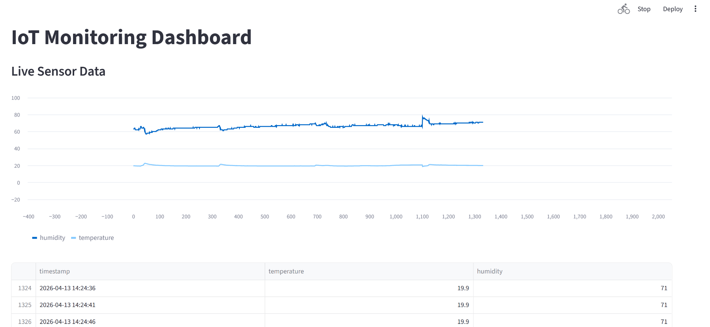

# Intelligent-IoT-Monitoring-System

## Overview
This project is a real-time IoT monitoring system using ESP32, DHT11 sensor, and MQTT protocol, Python backend, and a live dashboard.

It collects environmental data (temperature & humidity), transmits it via MQTT, processes it in a backend service, detects anomalies, and visualizes it in real-time.


## Dashboard Preview: Real-time visualization of temperature and humidity data:


## Anomaly Detection Output

Real-time anomaly detection using backend logic:


---
## Features
- ESP32 WiFi connectivity
- Secure credential handling using `secrets.h`
- Real-time temperature & humidity monitoring
- MQTT-based communication (publish/subscribe)
- Python backend for data ingestion
- CSV-based data storage
- Live dashboard using Streamlit
- Real-time anomaly detection (AI logic)
- JSON data pipeline
- Modular and scalable architecture

---

## System Architecture
DHT11 Sensor
↓
ESP32 (Firmware)
↓ WiFi
MQTT Broker (Mosquitto)
↓
Python Backend (Subscriber)
↓
CSV Storage
↓
Streamlit Dashboard (Live Visualization)

## Hardware Used
- ESP32 Dev Module
- DHT11 Temperature & Humidity Sensor
- Breadboard & Jumper Wires

## Software Used
- Arduino IDE
- Python 3
- MQTT (Mosquitto Broker)
- PubSubClient Library (ESP32)
- DHT Sensor Library
- paho-mqtt (Python)
- Streamlit (Dashboard)
- Pandas (Data processing)
- Git & GitHub


## MQTT Configuration
- Broker: Local Mosquitto
- Port: 1883
- Topic: `iot/sensor`

## Sample Data

```json
{"temp":19.5,"hum":64}
```
## Security
- WiFi credentials stored in secrets.h
- secrets.h excluded using .gitignore
- Prevents exposure of sensitive data on GitHub

## AI / Smart Logic

 The system includes real-time anomaly detection:
  - Detects abnormal temperature/humidity values
  - Generates alerts when values exceed normal range

## Testing Approach

Anomaly detection was validated using controlled testing:
- External heat sources (e.g., lighter) were used to simulate high temperature conditions
- Environmental variations were introduced to test humidity thresholds
- This ensured the system correctly detects and flags abnormal readings in real-time

Example output:

ALERT: Temperature anomaly detected: 45.8 °C | ALERT: Humidity anomaly detected: 99.0 %

## Progress
- WiFi connection established (ESP32)
- Sensor data acquisition (DHT11)
- MQTT local broker setup (Mosquitto)
- ESP32 publishing data via MQTT
- Python backend subscriber implemented
- Data stored in CSV file
- Real-time dashboard using Streamlit
- Anomaly detection implemented and tested

## How to Run
### 1. Clone Repository

```
git clone https://github.com/your-username/intelligent-iot-monitoring-system.git
cd intelligent-iot-monitoring-system
```
### 2. Install Requirements (Python Backend)

```
pip install paho-mqtt streamlit pandas
```

### 3. Install MQTT Broker (Mosquitto)

Download and install: https://mosquitto.org/download/

### 4. Start MQTT Broker
 
```
mosquitto -v
```
### 5. Run Backend Subscriber

```
cd backend
python mqtt_subscriber.py
```
### 6. Run Dashboard
```
streamlit run dashboard.py
```
Open in browser:
```
http://localhost:8501
```

### 7. Setup ESP32 Firmware
- Open Arduino IDE
- Install libraries: DHT sensor library (Adafruit), PubSubClient (Nick O’Leary)
- Update: WiFi credentials in secrets.h, MQTT server IP (your laptop IP)

### 8. Upload Code to ESP32
- Select board: ESP32 Dev Module
- Upload code
- Open Serial Monitor (115200 baud)

### 9. View Live Data
- Dashboard updates in real-time
- CSV file logs data in backend

## Key Learnings
- IoT system design (end-to-end pipeline)
- MQTT protocol (publish/subscribe model)
- Embedded systems (ESP32 + sensors)
- Backend development (Python subscriber)
- Data handling & storage
- Real-time visualization with streamlit
- Debugging networking & system issues
- AI-based anomaly detection

## Next Steps
- Machine Learning-based anomaly detection
- Database integration
- Alert system (Email/Telegram)
- Cloud deployment
- Mobile/web app integration

### Author
Devan Sandela