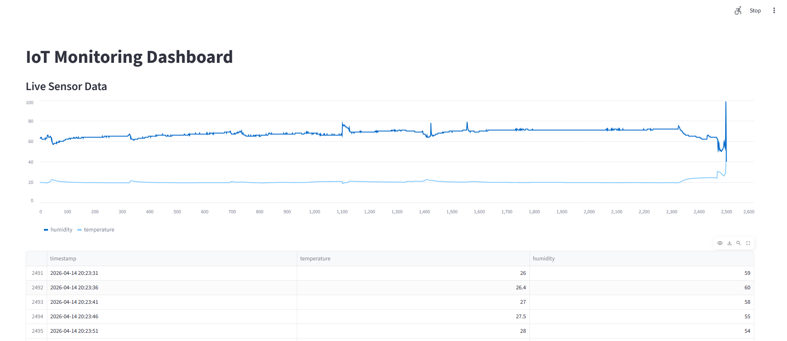
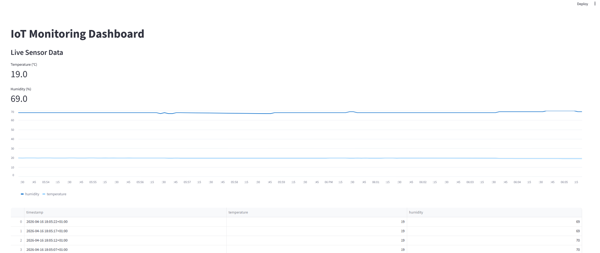
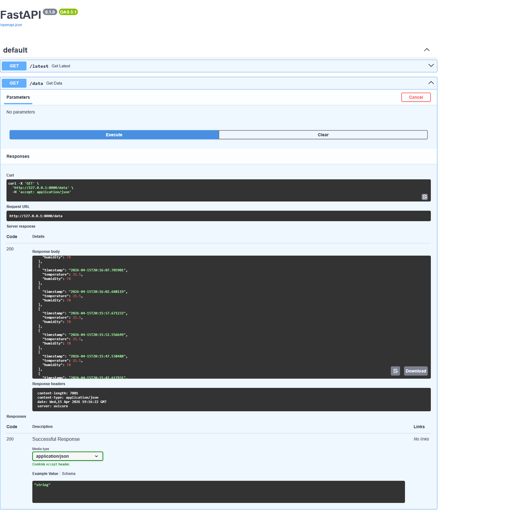
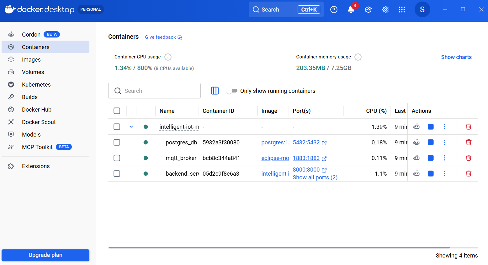
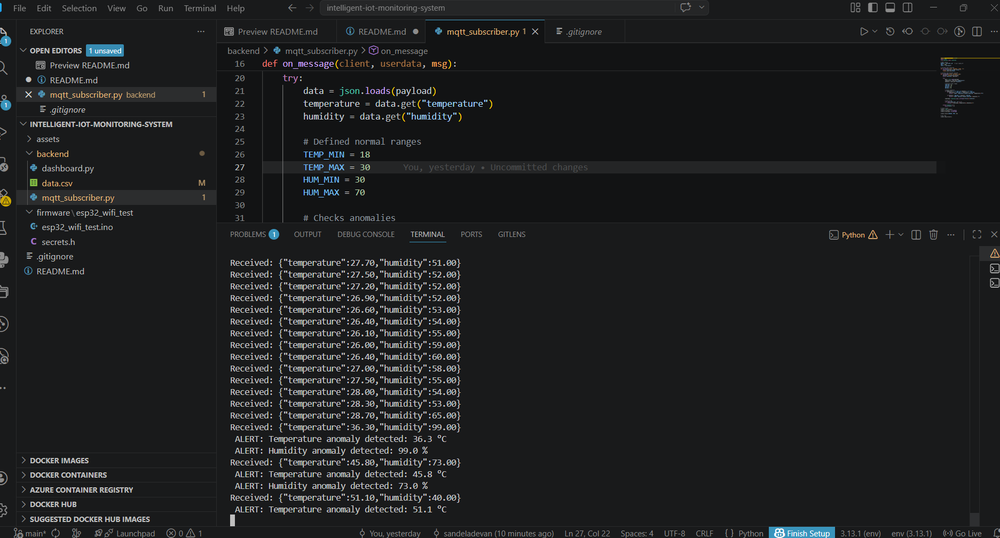

# Intelligent-IoT-Monitoring-System

## Overview
End-to-end real-time IoT system integrating embedded hardware, backend processing, APIs, anomaly detection, and containerized deployment

## What This Project Demonstrates
- Embedded Systems (ESP32 + DHT11)
- Real-time communication using MQTT
- Backend data processing + anomaly detection
- Database integration (PostgreSQL)
- REST API (FastAPI)
- Live visualization (Streamlit)
- Full system containerization (Docker)

## System Architecture
```
ESP32 + DHT11
↓
MQTT Broker 
↓
Python Backend (Subscriber)
↓
PostgreSQL Database
↓
FastAPI (REST API)
↓
Streamlit Dashboard
```

## Dashboard : Real-time visualization
<p>
  
  
</p>

- Live temperature & humidity monitoring
- Historical trend visualization
- Tabular data view

## API (FastAPI)
#### API Endpoint Output (/data)
 

Endpoints:
- GET /data → Full dataset
- GET /latest → Latest reading

JSON-based real-time data access,  
Interactive Swagger UI

## Docker Deployment (Production-Style)
<p>
  
</p>

Services:

mqtt_broker → Mosquitto  
postgres_db → PostgreSQL  
backend_service → API + Dashboard + Subscriber

Run everything:
```
docker-compose up --build
```

## Anomaly Detection



- Detects abnormal values in real-time
- Uses threshold-based logic
```
TEMP_MIN = 18°C
TEMP_MAX = 30°C
HUM_MIN = 30%
HUM_MAX = 70%
```
Example:

```
ALERT: Temperature anomaly detected: 45.8 °C  
ALERT: Humidity anomaly detected: 99.0 %
```

## Tech Stack
### Hardware
ESP32  
DHT11 Sensor
### Arduino IDE
PubSubClient  MQTTLibrary (ESP32)  
DHT Sensor Library
### Backend
Python  
paho-mqtt  
psycopg2
### API & Visualization
FastAPI  
Streamlit  
Pandas  
### Database
PostgreSQL
### DevOps
Docker  
Docker Compose  
Mosquitto  


## Quick Start
### 1. Clone Repo

```
git clone https://github.com/sandeladevan/intelligent-iot-monitoring-system.git
cd intelligent-iot-monitoring-system
```
### 2. Run System (Docker)

```
docker-compose up --build
```

### 3. Access
- Dashboard -> http://localhost:8501
- APIs Docs -> http://localhost:8501/docs

### Manual Setup (Without Docker)
1. Install dependencies
2. Start Mosquitto
3. Setup PostgreSQL
4. Run backend
5. Run API
6. Run dashboard

### Security
Credentials stored in secrets.h  
.gitignore prevents leaks

### Testing & Validation
- Simulated high temperature using heat source
- Tested humidity variations
- Verified anomaly detection triggers

### Key Learnings
- IoT system design (end-to-end)
- MQTT protocol (pub/sub architecture)
- Backend API development
- Database integration
- Real-time data visualization
- Docker containerization
- Debugging distributed systems

### Future Improvements
Cloud deployment   
Authentication

### Author
Devan Sandela
